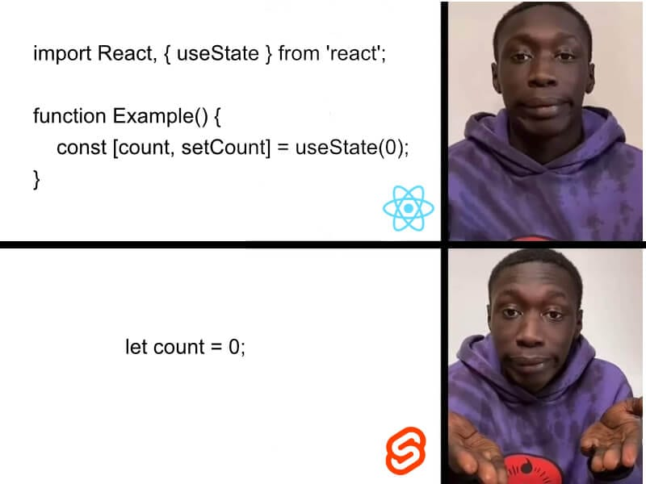

## What is Svelte & SvelteKit?

There are tons of great resources and tutorials out there, so here just a high-level introduction.

[Svelte](http://svelte.dev) is a component framework that allows you to break up your application into reusable chunks. Svelte compiles itself away during the build process into vanilla html, css, and javascript.

[SvelteKit](http://kit.svelte.dev) is a Svelte framework for building web applications of all sizes, with a beautiful development experience and flexible filesystem-based routing.

### How Svelte saves developer's mental fatigue?

#### Less Javascript & boilerplate



This is my true feeling. Why should I write lines of code just to update a value?
Reactivity, this is all I need. Svelte really gives me productivity to focus on designing great UX but don't compromise on DX.

#### Svelte Store - Native State Management

I totally get the "goodness" of immutability, especially after I learned how redux works.
Even I switched to RTK - Redux ToolKit later, I still feel awful to write so many codes JUST to update a value safely in React.

Reactivity shines again, svelte store is easy to use and customizable. Co-worker and future self can easily understand it's a store with a $ prefix. I didn't feel a pain to manage global stores when my Svelte project scaled.

#### HTML & CSS as a first class citizen

You can write native html & css (scoped) without a pain. That's a huge win for me because I just don't like className & CSS-in-JS.

Svelte released style directives in 3.46 which provides handy syntax sugar to write dynamic styles. You can check Geoff's
(Svelte maintainer) [article](https://geoffrich.net/posts/style-directives/) for use cases.

#### SvelteKit - Go-to framework to build Svelte app

React is a javascript library but not a framework, which means you need to figure out how to build your app properly. I believe for most React beginners, what we need is a single recommendation but not paradox of choice. What is the best option which gives me overall the best outcome with least amount of trade-offs?

So I was excited when I found SvelteKit is the go-to framework in Svelte world. Here are features I love about SvelteKit:

* **Filesystem-based Routing:**
It's way easier to understand and use compare to React Router.

* **Layout:**
It's a component that you can put elements that should be visible on every page, such as top-level navigation or a footer. It's really convenient and easier to manage your global layout and route content.

* **Adapters:**
My purpose is to build each service to SPA at the first stage of migration. adapter-static is a great fit to build SPA and I can easlily switch to other adapters depends on our requirement in the future

```js
// svelte.config.js
import preprocess from 'svelte-preprocess'
import adapter from '@sveltejs/adapter-static'

/** @type {import('@sveltejs/kit').Config} */
const config = {
    // Consult https://github.com/sveltejs/svelte-preprocess
    // for more information about preprocessors
    preprocess: [preprocess({
        postcss: true
    })],

    kit: {
        // I can even build php file which I can use in current project seamlessly!
        adapter: adapter({
            fallback: 'myapp.php' 
        }),
        files: {
            assets: 'src/assets',
        },
        appDir: 'myapp',
    }
}

export default config
```

* **Use Vite under the hood:** As I mentioned earlier, Vite had saved me from javascript tooling hell. After two months development in SvelteKit, everything works like a charm.

#### Svelte Community

I think this is the most important reason that I love Svelte so much, and it's definately part of the DX.

* [Svelte Summit](https://sveltesummit.com/) - An event dedicated to Svelte and its community.
* [Svelte Society](https://sveltesociety.dev/) - Great resources and support from the community.
* [Svelte Sirens](https://sveltesirens.dev/) - A Svelte Society for women, non-binary people, & allies
* [Svelte Discord Channel](https://svelte.dev/chat) - Go-to online forums and chats