```mermaid
graph TD
    subgraph L2["L2 Blockchain"]
        Wallet["Wallet (Transaction Creation)<br>• Constructs TX (to, value, nonce, gas)<br>• Signs with Dilithium (PQC)<br>• Outputs raw payload"]
        Broadcast["Broadcast<br>• Submits via JSON-RPC (eth_sendRawTransaction)<br>• OR libp2p Gossipsub (transactions topic)"]
        PeerProp["Peer-to-Peer Propagation<br>• Nodes discover via libp2p DHT/mDNS<br>• Gossipsub floods TX<br>• Encrypted with Kyber (PQC-KEM)"]
        TXVal["Transaction Validation<br>• Verifies Dilithium signature<br>• Checks nonce, balance, gas<br>• Drops invalid TX"]
        Mempool["Mempool<br>• Stores TXs sorted by gasPrice<br>• Enforces size/gas limits"]
        BlockAssembly["Block Assembly<br>• Validator selects TXs<br>• Builds Merkle roots (SHAKE256)<br>• Temporary stateRoot"]
        BlockSignProp["Block Signing & Propagation<br>• Validator signs block with Dilithium<br>• Broadcasts via Gossipsub (blocks topic)"]
        BlockRecVal["Block Reception & Validation<br>• Verifies Dilithium signature<br>• Replays TXs for stateRoot<br>• Applies BFT finality"]
        StateExec["State Execution<br>• EVM runs TXs, updates trie<br>• SHAKE256 for stateRoot<br>• Deducts fees, increments nonce"]
        Finalization["Finalization<br>• Block becomes irreversible<br>• TXs gain L2 immutability"]
        Explorer["Explorer Indexing<br>• Parses blocks/TXs<br>• Stores in DB (Postgres/MongoDB)<br>• Serves via REST/GraphQL"]
        BridgeRelayer["Bridge Relayer<br>• Monitors L2 withdrawals<br>• Generates SPHINCS+ proofs (PQC)<br>• Prepares L1 TX"]

        Wallet --> Broadcast
        Broadcast --> PeerProp
        PeerProp --> TXVal
        TXVal --> Mempool
        Mempool --> BlockAssembly
        BlockAssembly --> BlockSignProp
        BlockSignProp --> BlockRecVal
        BlockRecVal --> StateExec
        StateExec --> Finalization
        Finalization --> Explorer
        Explorer --> BridgeRelayer
    end

    subgraph L1["L1 Blockchain"]
        BridgeSubmit["Bridge Submission (to L1)<br>• Relayer sends proof to L1 contract<br>• SPHINCS+ proof in calldata"]
        L1Confirm["L1 Inclusion & Confirmation<br>• Ethereum validates proof<br>• 12+ block confirmations<br>• Mints/unlocks assets"]

        BridgeRelayer --> BridgeSubmit
        BridgeSubmit --> L1Confirm
    end

```

---

### 1. **PQC (Post-Quantum Cryptography)**

A set of cryptographic algorithms designed to resist attacks from **quantum computers** (future super-powerful machines that could crack today’s encryption).

**What it solves**:

- Today, blockchain relies on **ECDSA** (secp256k1) for signatures and **SHA-256** for hashing. Quantum computers could break these.
- PQC replaces those with quantum-resistant alternatives, ensuring transactions stay secure even in the quantum era.

**Analogy**:  
Swapping out a lock that future thieves could pick (ECDSA) with a lock they can’t (Dilithium/SPHINCS+).

---

### 2. **Dilithium**

A **post-quantum digital signature scheme** (like ECDSA but quantum-safe).

- **Replaces ECDSA** for signing transactions.
- When you call `eth_sendRawTransaction`, instead of using `secp256k1` to sign, you’d use Dilithium.

**Why it matters**:

- Your transaction’s signature can’t be forged or reversed by a quantum computer.
- Still works with wallets, explorers, and RPCs—just the math under the hood changes.

---

### 3. **Kyber (PQC-KEM)**

A **Key Encapsulation Mechanism (KEM)** for securely sharing encryption keys over a network.

- Replaces **ECDH** (used in protocols like libp2p’s Noise) for encrypting peer-to-peer messages.
- When nodes gossip transactions/blocks, Kyber ensures hackers can’t decrypt the traffic, even with quantum computers.

**Analogy**:  
Upgrading TLS 1.2 (HTTPs) to TLS 1.3—better encryption, same workflow.

---

### 4. **SHAKE256**

A **quantum-resistant hash function** (part of the SHA-3 family).

- Replaces **Keccak-256** (used in Ethereum for hashing transactions, blocks, and state roots).
- When you hash a transaction (`keccak256(RLP_encode(tx))`), you’d use SHAKE256 instead.

**Why it matters**:

- Prevents quantum computers from finding hash collisions (e.g., forging Merkle proofs).

---

### 5. **BFT (Byzantine Fault Tolerance)**

A **consensus mechanism** where nodes vote to agree on the validity of blocks.

- After a block is proposed, validators vote (e.g., “Is this block valid?”).
- Requires **⅔ of validators** to agree for finality (like in Tendermint or Fantom).

**Why you care**:

- Ensures your transaction isn’t reversed after finality (no 51% attacks).
- Works with PQC: even if validators use quantum-safe keys, BFT keeps consensus secure.

---

### 6. **SPHINCS+**

A **stateless, hash-based signature scheme** (quantum-safe but slower than Dilithium).

- Used for **cross-chain bridges** (e.g., withdrawals from L2 to L1).
- Generates proofs (like Merkle proofs) with quantum-safe signatures.

**Why you care**:

- If bridging assets, SPHINCS+ ensures withdrawal proofs can’t be forged by quantum attackers.

---

### **How This All Fits Into Your Workflow**

Let’s map this to the transaction lifecycle:

1. **Transaction Creation**:

   - Instead of `secp256k1.sign(txHash, privateKey)`, you’d use **Dilithium**.
   - Hashing the transaction? Use **SHAKE256** instead of Keccak.

2. **Broadcasting**:

   - When your node sends the TX via libp2p, **Kyber** encrypts the gossip.

3. **Validation**:

   - Nodes verify your Dilithium signature and SHAKE256 hash.
   - Mempool prioritizes TXs as usual—just with quantum-safe checks.

4. **Block Inclusion**:

   - Validators use **BFT** to agree on the block (finality in 1-2 seconds).
   - Block hashes and state roots use SHAKE256.

5. **Cross-Chain (Bridges)**:
   - Withdrawals from L2 to L1 use **SPHINCS+** for proofs (quantum-safe but slower).

---

### **Key Takeaways**

- **No workflow changes**: Signing, sending, and validating transactions work the same—just swap the crypto.
- **L1 Smart Contracts**: Verifying Dilithium/SPHINCS+ on Ethereum requires new precompiles (e.g., `verifyDilithium(bytes sig, bytes pubKey)`).
- **Why bother now?** Future-proofing. Today’s transactions recorded on-chain could be hacked **later** by quantum computers.
